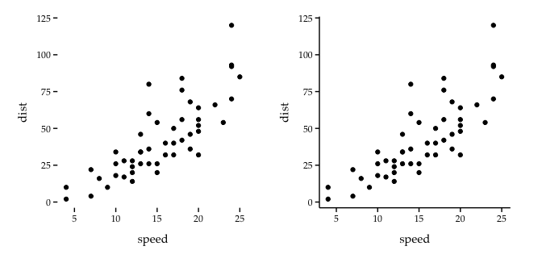
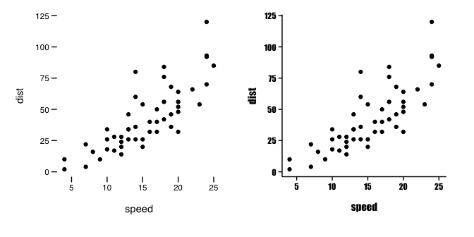
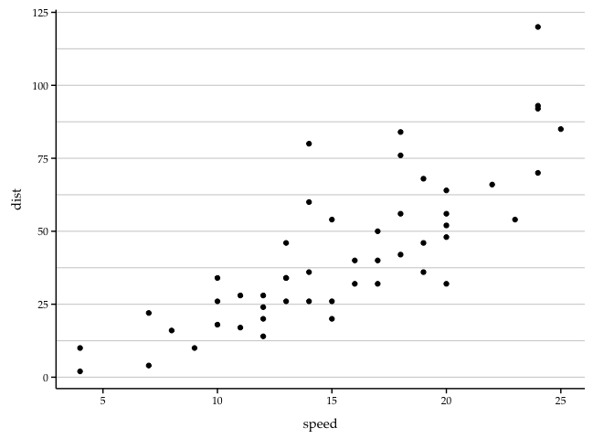
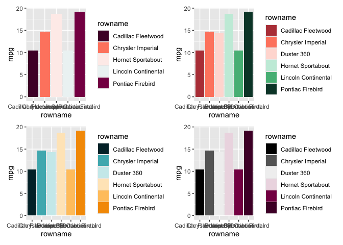
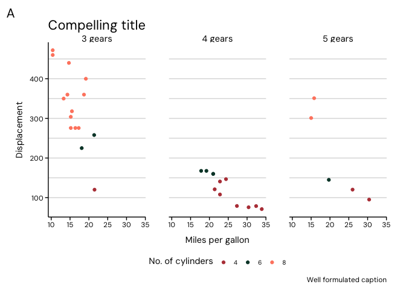
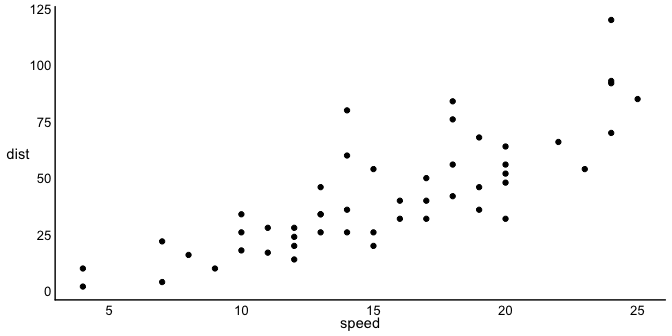
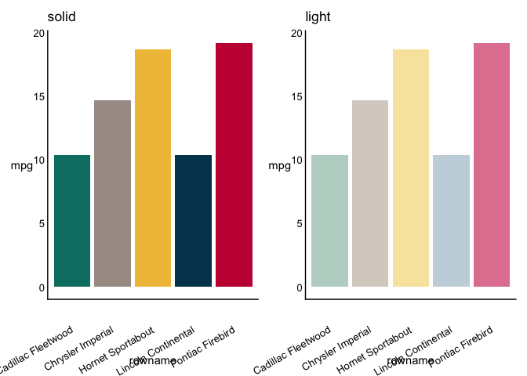
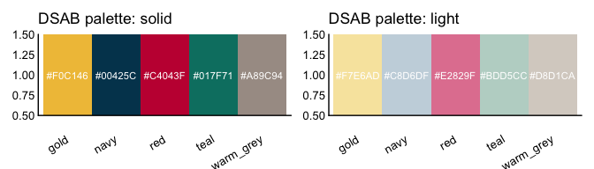
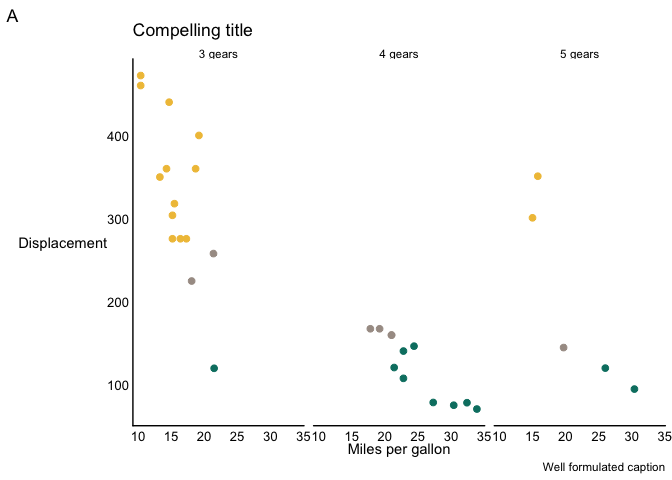

<!-- README.md is generated from README.Rmd. Please edit that file -->

# crgg

<!-- badges: start -->
<!-- badges: end -->

`crgg` is a package with my personal themes. I think they are really
nice and possibly useful for others too.

## Installation

You can install crgg from [GitHub](https://github.com/) with:

``` r
# install.packages("devtools")
devtools::install_github("reitancorp/crgg")
```

## Usage

`crgg` includes two themes, `theme_crgg_minimal()` and
`theme_crgg_standard()`. They can be used like any standard `ggplot`
theme:

``` r
library(ggplot)
library(crgg)
...
my_ggplot + theme_crgg_standard()
```

What’s the differeence between the minimal and standard themes? Lets
check:

``` r
myplot <-
  cars %>%
  ggplot(aes(x = speed, y = dist)) +
  geom_point()
p1 <- myplot + theme_crgg_minimal()
#> Warning: The `size` argument of `element_rect()` is deprecated as of ggplot2 3.4.0.
#> ℹ Please use the `linewidth` argument instead.
#> ℹ The deprecated feature was likely used in the crgg package.
#>   Please report the issue to the authors.
#> This warning is displayed once every 8 hours.
#> Call `lifecycle::last_lifecycle_warnings()` to see where this warning was
#> generated.
p2 <- myplot + theme_crgg_standard()
p1 + p2
```



So, as you can see, minimal has no axis lines, but standard does.

## Fonts

The themes includes the arguments `base_size` and `base_size` which
controls font size and typeface. The standard is `base_size = 8` and
`base_family = "Palatino"`. Note that the font needs to be installed on
your computer, and fonts at least works fine on MacOS.

``` r
p3 <- myplot + theme_crgg_minimal(base_size = 12, base_family = "Helvetica")
p4 <- myplot + theme_crgg_standard(base_siz = 8, base_family = "Impact")
p3 + p4
```



## Color themes

The themes also includes some standard color schemes through the
argument `bgcolor`. Options for `theme_crgg_minimal()` are `"white"`or
`"black"`. For `theme_crgg_standard()`, `"white"`, `"grey"`,
`"offwhite"`, `"black"`

``` r
p6 <- myplot + theme_crgg_standard(bgcolor = "white")
p7 <- myplot + theme_crgg_standard(bgcolor = "grey")
p8 <- myplot + theme_crgg_standard(bgcolor = "offwhite")
p9 <- myplot + theme_crgg_standard(bgcolor = "black")
(p6 + p7) / (p8 + p9)
```

## Horizontal lines

Use `horizontal = TRUE`for horizontal lines.

``` r
myplot + theme_crgg_standard(horizontal = T)
#> Warning: The `size` argument of `element_line()` is deprecated as of ggplot2 3.4.0.
#> ℹ Please use the `linewidth` argument instead.
#> ℹ The deprecated feature was likely used in the crgg package.
#>   Please report the issue to the authors.
#> This warning is displayed once every 8 hours.
#> Call `lifecycle::last_lifecycle_warnings()` to see where this warning was
#> generated.
```



# KI color palettes

Because I am affiliated with KI I sometimes have to use their official
graphic profile.

**Karolinska Institutet graphical profile at a glance:**

- **Font:** DM Sans (free, download at
  [fonts.google.com/specimen/DM+Sans](https://fonts.google.com/specimen/DM+Sans))
- **Primary colour:** KI teal (`#008F7A`)
- **Palette structure:** one primary palette (5 colours) and three
  functional palettes (`ki_function_1/2/3`, 6 colours each), defined
  from [KI’s official brand
  colours](https://medarbetare.ki.se/farger-i-kis-grafiska-profil)
- **Theme:** use `theme_ki_standard()` — identical to
  `theme_crgg_standard()` but with DM Sans as default font

NOTE: For the full KI experience, use `base_family = "DM Sans"`. The
palette functions support three orderings
(`order = c("original", "gradient", "hue")`); `"gradient"` (default)
works best for continuous-like data.

The package includes `scale_fill_ki_d()`, `scale_fill_ki_c()`,
`scale_color_ki_d()` and `scale_colour_ki_c()` for discrete and
continuous scales.

Let’s have a look:

``` r
barplot5 <-
  mtcars %>%
  arrange(desc(disp)) %>%
  filter(row_number() %in% 1:5) %>%
  rownames_to_column() %>%
  ggplot(aes(x = rowname, y = mpg, fill = rowname)) +
  geom_col()
p10 <-
  barplot5 +
  scale_fill_ki_d(palettename = "ki_primary")
barplot <-
  mtcars %>%
  arrange(desc(disp)) %>%
  filter(row_number() %in% 1:6) %>%
  rownames_to_column() %>%
  ggplot(aes(x = rowname, y = mpg, fill = rowname)) +
  geom_col()
p11 <- barplot +
  scale_fill_ki_d(palettename = "ki_function_1")
p12 <- barplot +
  scale_fill_ki_d(palettename = "ki_function_2")
p13 <- barplot +
  scale_fill_ki_d(palettename = "ki_function_3")
(p10 + p11) / (p12 + p13)
```



Note that `ki_primary` only contains 5 colors.

## Putting it all together

Lets make a nice graph:

``` r
mtcars %>%
  ggplot(aes(x = mpg, y = disp, color = factor(cyl))) +
  geom_point() +
  facet_wrap(~ case_when(gear == 3 ~ "3 gears", gear == 4 ~ "4 gears", gear == 5 ~ "5 gears")) +
  theme_crgg_standard(base_family = "DM Sans", horizontal = T) +
  scale_colour_ki_d(palettename = "ki_function_1", order = "hue") +
  ylab("Displacement") +
  xlab("Miles per gallon") +
  labs(
    color = "No. of cylinders",
    caption = "Well formulated caption",
    tag = "A",
    title = "Compelling title"
  )
```



# DS theme and color palettes

**DS (Danderyds Sjukhus) graphical profile at a glance:**

- **Font:** Arial
- **5 solid brand colours:** teal `#017F71`, warm grey `#A89C94`, gold
  `#F0C146`, navy `#00425C`, red `#C4043F` (Pantone-referenced)
- **5 light tint colours:** matching pastel variants for backgrounds,
  secondary series, or paired solid/light use
- **Theme:** `theme_ds_standard()` — minimal axis-only theme; no grid,
  no background, just the two axis lines

`theme_ds_standard()` uses Arial by default and strips everything except
the two axis lines, axis text, and axis titles.

``` r
myplot + theme_ds_standard()
```



## DSAB color palettes

The package includes `scale_colour_ds()` and `scale_fill_ds()` with two
palette types: `"solid"` (5 Pantone brand colours) and `"light"` (5
matching tints).

``` r
barplotds <-
  mtcars %>%
  dplyr::arrange(desc(disp)) %>%
  dplyr::filter(dplyr::row_number() %in% 1:5) %>%
  tibble::rownames_to_column() %>%
  ggplot(aes(x = rowname, y = mpg, fill = rowname)) +
  geom_col() +
  theme_ds_standard(legend = FALSE) +
  theme(axis.text.x = element_text(angle = 30, hjust = 1))

p14 <- barplotds + scale_fill_ds(type = "solid") + ggtitle("solid")
p15 <- barplotds + scale_fill_ds(type = "light") + ggtitle("light")
p14 + p15
```



You can preview all palette colours with `show_ds_palette()`:

``` r
show_ds_palette("solid") + show_ds_palette("light")
```



## Putting it all together (DSAB)

``` r
mtcars %>%
  ggplot(aes(x = mpg, y = disp, color = factor(cyl))) +
  geom_point(size = 2) +
  facet_wrap(~ case_when(gear == 3 ~ "3 gears", gear == 4 ~ "4 gears", gear == 5 ~ "5 gears")) +
  theme_ds_standard() +
  scale_colour_ds(type = "solid") +
  ylab("Displacement") +
  xlab("Miles per gallon") +
  labs(
    color = "No. of cylinders",
    caption = "Well formulated caption",
    tag = "A",
    title = "Compelling title"
  )
```


